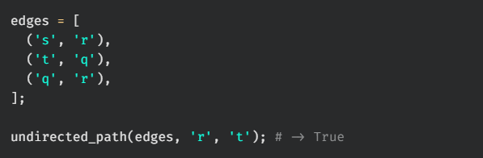

# undirected path

Write a function, `undirected_path`, that takes in a list of edges for an undirected graph and two nodes (node_A, node_B). The function should return a boolean indicating whether or not there exists a path between node_A and node_B.

## Test Cases

`test_00:`  

`test_01:`  

`test_02:`  

`test_03:`  

`test_04:`  

`test_05:`  

`test_06:`  

`test_07:`  

`test_08:`  

`test_09:`  
