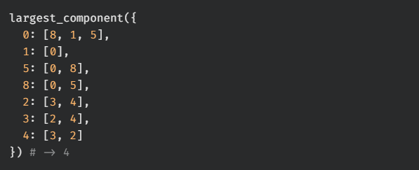
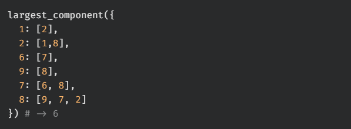
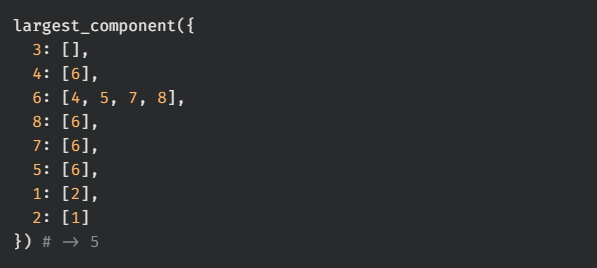
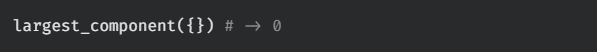
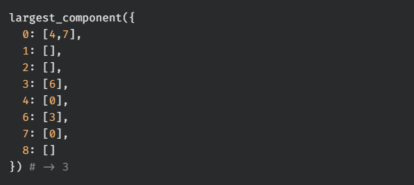

# largest component

Write a function, `largest_component`, that takes in the adjacency list of an undirected graph. The function should return the size of the largest connected component in the graph.

## Test Cases

`test_00:`  

`test_01:`  

`test_02:`  

`test_03:`  

`test_04:`  
