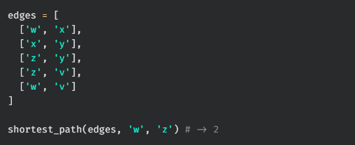
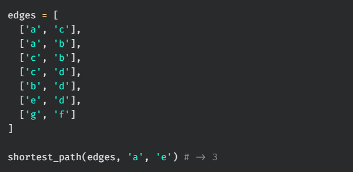
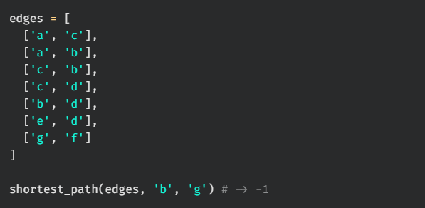
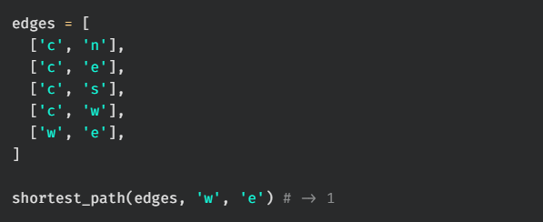
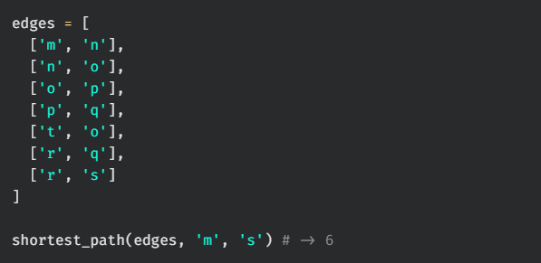

# shortest path

Write a function, `shortest_path`, that takes in a list of edges for an undirected graph and two nodes (node_A, node_B). The function should return the length of the shortest path between A and B. Consider the length as the number of edges in the path, not the number of nodes. If there is no path between A and B, then return -1.

## Test Cases

`test_00:`  

`test_01:`  

`test_02:`  

`test_03:`  

`test_04:`  

`test_05:`  

`test_06:`  

`test_07:`  
