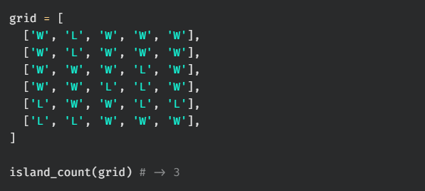
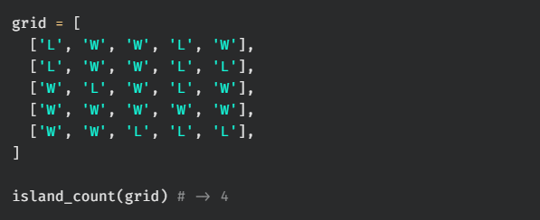
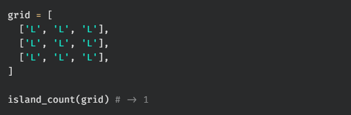
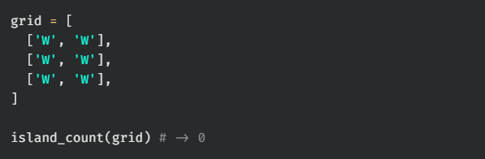

# island count

Write a function, `island_count`, that takes in a grid containing Ws and Ls. W represents water and L represents land. The function should return the number of islands on the grid. An island is a vertically or horizontally connected region of land.

## Test Cases

`test_00:`  

`test_01:`  

`test_02:`  

`test_03:`  
