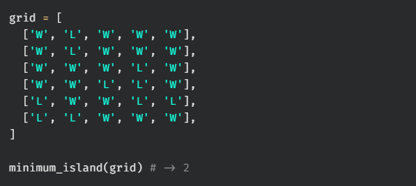
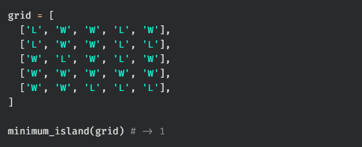
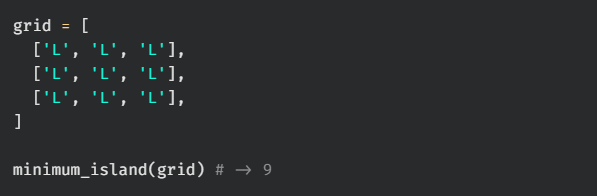
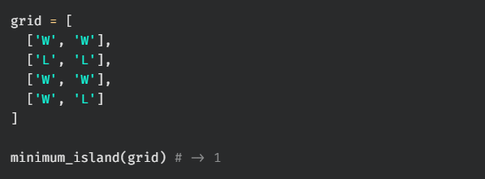

# minimum island

Write a function, `minimum_island`, that takes in a grid containing Ws and Ls. W represents water and L represents land. The function should return the size of the smallest island. An island is a vertically or horizontally connected region of land.

You may assume that the grid contains at least one island.

## Test Cases

`test_00:`  

`test_01:`  

`test_02:`  

`test_03:`  
